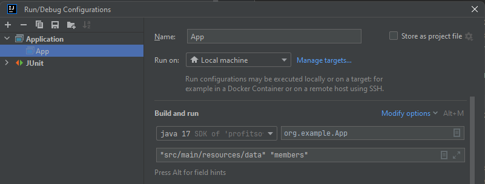

# Simple application for collecting statistics on a specific attribute.

## Before running the application, you need to specify two parameters in the run settings:
1. The path to the folder containing the JSON files that will be read to collect statistics.
2. The attribute by which the statistics will be collected.

## Example:



## In this application, the domain area chosen is projects and their participants, which have the following properties:
1. name - project name
2. members - project members
3. tasks - names of tasks to be performed on the project
4. description - project description
5. begin_date - the start date of the project in the format "2024-05-12"

The application implements the collection of statistics if the property is written as a comma-separated list.
All fields can be represented either in singular or as a list.
Statistics in the format statistics_by_(attribute_name) will be added to the root of the project.

## Example of statistics:
```xml
<statistics>
  <items>
    <item>
      <value>Sarah</value>
      <count>51080</count>
    </item>
    <item>
      <value>Alice</value>
      <count>38400</count>
    </item>
    <item>
      <value>Michael</value>
      <count>38400</count>
    </item>
    <item>
      <value>David</value>
      <count>38400</count>
    </item>
  </items>
</statistics>
```

## Results of changing the number of threads:
461 ms - 1 thread <br/>
412 ms - 2 threads <br/>
438 ms - 4 threads <br/>
422 ms - 6 threads <br/>